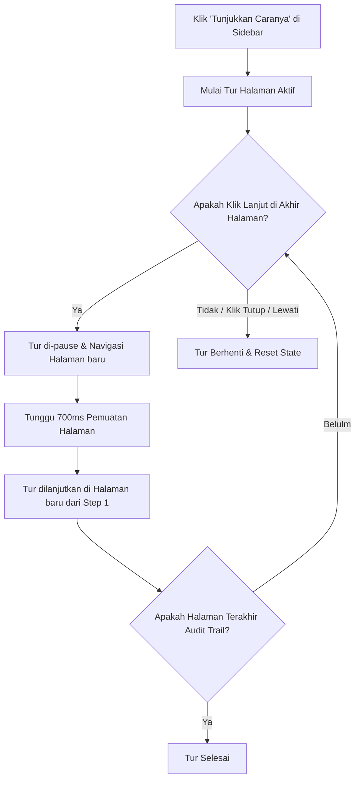

# Dokumentasi Sistem Onboarding Tutorial (EMS BFS)

Dokumen ini menjelaskan implementasi fitur **Onboarding Tutorial (Panduan Interaktif)** yang baru saja ditambahkan ke sistem AHU Monitoring EMS BFS. Fitur ini dirancang untuk memandu pengguna baru dalam memahami fungsionalitas utama dari setiap halaman secara interaktif menggunakan bahasa Indonesia.

---

## 1. Arsitektur & Teknologi Utama
Fitur ini dibangun di atas tumpukan teknologi berikut:
- **`react-joyride` (v3.1.0)**: Library React untuk membuat panduan interaktif step-by-step (*guided tours*).
- **React Context API (`contexts/TutorialContext.tsx`)**: Mengatur state global untuk memulai, menjeda, melanjutkan, dan menghentikan tutorial.
- **Next.js App Router Navigation hooks**: `usePathname` dan `useRouter` untuk mendeteksi lokasi rute dan melakukan navigasi antar halaman secara otomatis.

---

## 2. Struktur File & Modifikasi Code

### A. Context Tutorial (`contexts/TutorialContext.tsx`) - *File Baru*
Mengelola state global tutorial. State ini harus tetap ada meskipun terjadi pergantian rute Next.js (tidak unmount karena dibungkus di root provider).
- **`runTutorial` (boolean)**: Menentukan apakah tur sedang berjalan (aktif) di halaman saat ini.
- **`isMultiPage` (boolean)**: Menandai apakah pengguna sedang dalam mode "walkthrough keliling seluruh aplikasi" secara bertahap.
- **Fungsi Utama**:
  - `startTutorial()`: Memulai tur multi-halaman dari awal.
  - `pauseTutorial()`: Mematikan render Joyride sementara waktu selama transisi navigasi halaman agar tidak terjadi error target elemen hilang (*Target not found*).
  - `resumeTutorial()`: Mengaktifkan kembali rendering tur setelah navigasi halaman selesai.
  - `stopTutorial()`: Menghentikan tur secara permanen dan mereset status.

### B. Komponen Tutorial (`components/TutorialComponent.tsx`) - *File Baru*
Komponen utama yang me-render Joyride secara kondisional.
- **Dynamic Steps**: Menggunakan `useMemo` dengan dependensi `pathname` untuk memetakan target elemen CSS (`h1`, `#exclusion-form`, `#exclusion-list`, dll.) dan konten penjelasan bahasa Indonesia untuk setiap halaman:
  - `/` (Dasbor)
  - `/data-management` (Manajemen Data)
  - `/reports` (Laporan)
  - `/emails` (Email Alerts)
  - `/audit-log` (Audit Trail)
- **State Reset (`key={pathname}`)**: Menggunakan properti `key` dengan nilai `pathname` pada komponen Joyride. Hal ini memaksa React untuk menghancurkan (*unmount*) instansi Joyride lama dan membuat instansi yang baru dari index `0` setiap kali pengguna berpindah halaman, mencegah retensi index langkah (*state retention bug*).
- **Seamless Transition Logic**:
  - Pada langkah terakhir di suatu halaman, tombol aksi berubah nama menjadi link halaman berikutnya (contoh: *"Lanjut ke Laporan"*).
  - Ketika diklik, callback mendeteksi status `finished` dan properti `isMultiPage: true`. Ia memanggil `pauseTutorial()`, melakukan `router.push('/target-halaman')`, dan membiarkan Next.js berpindah halaman.
  - Sebuah `useEffect` mendengarkan perubahan `pathname`. Jika rute berubah sementara statusnya `isMultiPage` aktif dan `runTutorial` mati, ia memasang timeout selama `700ms` untuk memberikan waktu halaman me-render elemen HTML baru, lalu memicu `resumeTutorial()`.

### C. Sidebar Component (`components/layout/Sidebar.tsx`) - *Modifikasi*
- Mengimpor hook `useTutorial` dan ikon `HelpCircle` dari `lucide-react`.
- Menambahkan tombol **"Tunjukkan Caranya"** (atau *"Show Me How"*) di bagian bawah sidebar.
- Menambahkan properti `id` unik pada setiap link menu navigasi (`#DashboardMenu`, `#DataManagementMenu`, `#ReportsMenu`, `#EmailAlertsMenu`, `#AuditLogMenu`) agar dapat ditargetkan secara presisi oleh penyorot (overlay) Joyride.

### D. Provider & Layout Wrapper - *Modifikasi*
- **`app/providers.tsx`**: Membungkus komponen anak (`children`) di dalam `LanguageProvider` dengan `TutorialProvider` baru agar statusnya dapat diakses dari mana saja (khususnya Sidebar dan layout utama).
- **`app/layout.tsx`**: Menyisipkan `<TutorialComponent />` di bagian bawah pohon DOM agar ia dapat menampilkan pop-up penunjuk (*popover*) secara global di semua halaman.

### E. Integrasi Bahasa (`contexts/LanguageContext.tsx`) - *Modifikasi*
Menambahkan kunci terjemahan untuk tombol tutorial di kedua kamus bahasa:
- **Kamus ID**: `"Show Me How": "Tunjukkan Caranya"`
- **Kamus EN**: `"Show Me How": "Show Me How"`

---

## 3. Alur Perilaku Pengguna (User Flow)

---

## 4. Cara Pengujian
1. Jalankan aplikasi menggunakan server pengembangan (`npm run dev`).
2. Masuk ke halaman **Dasbor**.
3. Klik tombol **"Tunjukkan Caranya"** pada sidebar sebelah kiri.
4. Ikuti instruksi pop-up penunjuk dengan mengeklik tombol **"Lanjut"**.
5. Pada akhir halaman Dasbor, klik tombol **"Lanjut ke Manajemen Data"**. Aplikasi akan berpindah halaman secara otomatis dan membuka panduan Manajemen Data langsung dari langkah pertama.
6. Coba klik tombol **"Lewati"** di tengah jalan untuk memastikan tutorial dapat ditutup sewaktu-waktu dengan sukses.
